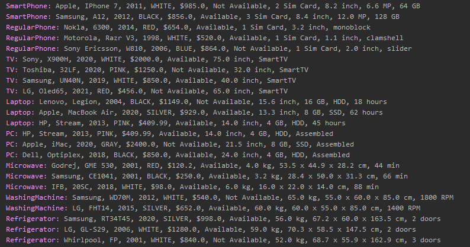

# Electronics Store

Electronics Store with colored console menu )) To run this program go to    [this file](src/main/Test.java).
 

</img>

 

## Models

- [Computers](src/models/Computer.java)
  - [Laptop](src/models/Laptop.java)
  - [PC](src/models/PC.java)

- [Mobile Phones](src/models/MobilePhone.java)
  - [Regular Phone](src/models/RegularPhone.java)
  - [SmartPhone](src/models/SmartPhone.java)
  
- [TV](src/models/TV.java)

- [Household Appliances](src/models/HouseholdAppliances.java)
  - [Microwave](src/models/Microwave.java)
  - [Refrigerator](src/models/Refrigerator.java)
  - [Washing Machine](src/models/WashingMachine.java)

## Interfaces

- [Features](src/models/Features.java)
- [Diagonal](src/models/Diagonal.java)
- [Hardware](src/models/Hardware.java)
- [Dimensions](src/models/Dimensions.java)

## Database

All data at files in [this folder](data), new objects are also adding here.
- [Laptops](data/Laptop.txt)
- [Microwaves](data/Microwave.txt)
- [PCs](data/PC.txt)
- [Refrigerators](data/Refrigerator.txt)
- [Regular Phones](data/LapRegularPhone.txt)
- [SmartPhones](data/SmartPhone.txt)
- [TVs](data/TV.txt)
- [Washing Machines](data/WashingMachine.txt)

## Services

View all services...

  
1. Print all Electronics
2. Print all Electronics in short form
3. Print all available Electronics
4. Print all available Electronics price less $1000
5. Print all Electronics sorted by price
6. Print oldest Electronics
7. Print name of most expensive Electronics
8. Print count of WHITE Electronics
1. Print all MobilePhones
2. Print all MobilePhones in short form
3. Print all available MobilePhones
4. Print all available MobilePhones price less $1000
5. Print all MobilePhones sorted by price
6. Print oldest MobilePhone
7. Print name of most expensive MobilePhone
8. Print count of WHITE MobilePhones
9. Print all MobilePhones sorted by screen size

1. Print all RegularPhones
2. Print all RegularPhones in short form
3. Print all available RegularPhones
4. Print all available RegularPhones price less $1000
5. Print all RegularPhones sorted by price
6. Print oldest RegularPhone
7. Print name of most expensive RegularPhone
8. Print count of WHITE RegularPhones
9. Print all RegularPhones sorted by screen size
10. Print all monoblock shell RegularPhones

1. Print all SmartPhones
2. Print all SmartPhones in short form
3. Print all available SmartPhones
4. Print all available SmartPhones price less $1000
5. Print all SmartPhones sorted by price
6. Print oldest SmartPhone
7. Print name of most expensive SmartPhone
8. Print count of WHITE SmartPhones
9. Print all SmartPhones sorted by screen size

1. Print all Computers
2. Print all Computers in short form
3. Print all available Computers
4. Print all available Computers price less $1000
5. Print all Computers sorted by price
6. Print oldest Computer
7. Print name of most expensive Computer
8. Print count of WHITE Computers
9. Print all SSD Computers RAM less or equal 16 GB

1. Print all PCs
2. Print all PCs in short form
3. Print all available PCs
4. Print all available PCs price less $1000
5. Print all PCs sorted by price
6. Print oldest PC
7. Print name of most expensive PC
8. Print count of WHITE PCs
9. Print all SSD PCs RAM less or equal 16 GB

1. Print all Laptops
2. Print all Laptops in short form
3. Print all available Laptops
4. Print all available Laptops price less $1000
5. Print all Laptops sorted by price
6. Print oldest Laptop
7. Print name of most expensive Laptop
8. Print count of WHITE Laptops
9. Print all SSD Laptops RAM less or equal 16 GB
10. Print all Laptops buttery life more 20 hours

1. Print all TVs
2. Print all TVs in short form
3. Print all available TVs
4. Print all available TVs price less $1000
5. Print all TVs sorted by price
6. Print oldest TV
7. Print name of most expensive TV
8. Print count of WHITE TVs
9. Print all Smart TVs names

1. Print all HouseholdAppliances
2. Print all HouseholdAppliances in short form
3. Print all available HouseholdAppliances
4. Print all available HouseholdAppliances price less $1000
5. Print all HouseholdAppliances sorted by price
6. Print oldest HouseholdAppliance
7. Print name of most expensive HouseholdAppliance
8. Print count of WHITE HouseholdAppliances
9. Print name of heavier HouseholdAppliance

1. Print all Microwaves
2. Print all Microwaves in short form
3. Print all available Microwaves
4. Print all available Microwaves price less $1000
5. Print all Microwaves sorted by price
6. Print oldest Microwave
7. Print name of most expensive Microwave
8. Print count of WHITE Microwaves
9. Print name of heavier Microwave

1. Print all WashingMachines
2. Print all WashingMachines in short form
3. Print all available WashingMachines
4. Print all available WashingMachines price less $1000
5. Print all WashingMachines sorted by price
6. Print oldest WashingMachine
7. Print name of most expensive WashingMachine
8. Print count of WHITE WashingMachines
9. Print name of heavier WashingMachine
10. Print WashingMachines in descending order by RPM

1. Print all Refrigerators
2. Print all Refrigerators in short form
3. Print all available Refrigerators
4. Print all available Refrigerators price less $1000
5. Print all Refrigerators sorted by price
6. Print oldest Refrigerator
7. Print name of most expensive Refrigerator
8. Print count of WHITE Refrigerators
9. Print name of heavier Refrigerator
10. Print name of higherRefrigerator

 

## Example

Print all Electronics in short form
 

</img>

 

## Models Dependencies
 

</img>

 

## Services Dependencies
 

</img>

 

## Menus Dependencies
 

</img>

 
